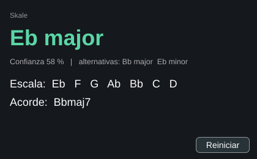
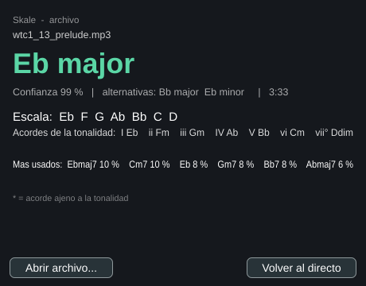

# Skale

Detecta la **escala de una canción**: tonalidad, notas de la escala, acordes diatónicos y los acordes que suenan. Objetivo final: un plugin de audio VST3/AU que funcione en tiempo real y con archivos mp3/wav.

Estado: **fase 2** (núcleo del analizador, herramienta de línea de comandos y plugin VST3 / aplicación independiente en tiempo real).

## Cómo funciona

1. **Cromagrama** (`src/analysis/Chromagram.*`): FFT con ventana Hann, picos espectrales entre 65 Hz y 2,1 kHz con interpolación parabólica, repartidos en 36 bins (3 por semitono). A partir del cromagrama acumulado se estima la afinación global (A=440 ±33 cents) y se pliega a 12 notas.
2. **Tonalidad** (`KeyDetector.*`): correlación de Pearson con los perfiles de Temperley o de Krumhansl-Schmuckler en las 24 tonalidades. La "confianza" es un softmax de esas correlaciones: una heurística, no una probabilidad calibrada.
3. **Teoría** (`Theory.*`): escala con la ortografía correcta (Eb mayor = Eb F G Ab Bb C D), acordes diatónicos con triadas, séptimas y números romanos.
4. **Acordes** (`ChordDetector.*`): plantillas (mayor, menor, 7, maj7, m7, dim, sus2, sus4) con similitud coseno y suavizado Viterbi. Marca los acordes ajenos a la tonalidad.

El extractor funciona en streaming (acepta bloques de cualquier tamaño), pensado para reutilizarlo en el plugin en tiempo real.

## Compilar y probar

    cmake -S . -B build
    cmake --build build -j
    ctest --test-dir build --output-on-failure

Solo hace falta un compilador C++17 y CMake. `third_party/dr_libs` (dr_wav, dr_mp3) lee wav y mp3.

## Plugin (VST3 y aplicación independiente)

    cmake -S . -B build-plugin -DSKALE_BUILD_PLUGIN=ON
    cmake --build build-plugin -j --target SkalePlugin_VST3 SkalePlugin_Standalone

JUCE (8.0.15) se descarga al configurar; no está en el repo. En Linux hacen falta ALSA, FreeType, Fontconfig y las cabeceras de X11, GL y GTK/WebKit (`libasound2-dev libfreetype-dev libfontconfig1-dev libx11-dev libxrandr-dev libxinerama-dev libxcursor-dev libxext-dev libgl1-mesa-dev`). El audio pasa sin tocarse: el hilo de audio solo copia muestras a un buffer circular sin bloqueos; otro hilo ejecuta `KeyTracker` (`src/analysis/KeyTracker.*`, sin dependencias de JUCE) con memoria de ~30 s y publica tonalidad, confianza, escala y acorde actual 5 veces por segundo.

**Archivos:** arrastra un wav, aiff, flac, ogg o mp3 sobre la ventana (o pulsa «Abrir archivo...») y se analiza entero en un hilo aparte con el mismo análisis que la CLI (final y bajo incluidos): tonalidad con confianza y alternativas, escala, acordes de la tonalidad y los acordes más usados (con * los ajenos a la tonalidad). «Volver al directo» regresa a la vista en tiempo real. Si el archivo no se puede leer o es silencio, lo dice. `SkalePluginSelfTest --file audio.mp3 captura.png` lo prueba sin interfaz gráfica.

Prueba sin anfitrión ni tarjeta de sonido (pasa un wav por `processBlock` en bloques de 512 y guarda una captura): `SkalePluginSelfTest audio.wav captura.png` (se construye con `--target SkalePluginSelfTest`). En los cuatro preludios probados el plugin da la misma tonalidad que el analizador de archivos sobre esos mismos 60 s.

**Licencia de JUCE:** JUCE se ofrece bajo AGPLv3 o con licencia comercial. Skale es propietario, así que **para distribuir el plugin hace falta la licencia comercial de JUCE** (compilarlo para uso propio no lo requiere). Alternativa sin JUCE: el SDK de VST3 (MIT) o CLAP, con una interfaz propia.

Limitaciones: no hay estado guardado, ni ajuste de la memoria ni de perfil en la interfaz, y el bonus del acorde final no se aplica (en tiempo real no hay final). El plugin no se ha probado en un anfitrión real (DAW) ni con `pluginval`.

## Línea de comandos

    build/skale-cli cancion.mp3 --timeline
    build/skale-cli cancion.wav --json --solfege
    build/skale-cli cancion.wav --profile ks

Opciones: `--json`, `--timeline` (línea de tiempo de acordes), `--solfege` (Do Re Mi), `--profile ks|temperley`.

### Bajo y acordes en la tonalidad (bajo activado por defecto, acordes opcionales)

- `--bass-weight <w>`: suma `w × (energía del bajo en la tónica + 0,5 × en la quinta)`, con un cromagrama aparte de 40–250 Hz.
- `--chord-weight <w>`: suma `w × (fracción de tiempo con acordes diatónicos + fracción con el acorde de tónica)` según los acordes detectados.

Barrido en 207 archivos (Temperley, con el final a 0,5 como base). Aciertos en música real de Jamendo (104) / total (207):

| Configuración | Jamendo (104) | Total (207) |
|---|---|---|
| Base (solo final) | 74 | 144 |
| + bajo 0,3 / 0,6 / 1 | 77 / 80 / **81** | 147 / 153 / 154 |
| + acordes 0,3 / 0,6 / 1 | 70 / 69 / 69 | 144 / 144 / 144 |
| + bajo 0,6 y acordes 0,6 | 78 | **156** |
| KS + acordes 0,6 | 82 | 154 |

El bajo mejora de forma monótona en pop/rock (74 → 81) y también en las fugas (18 → 20). Los acordes mejoran mucho la clásica (preludios 24/24, fugas hasta 22/24) pero **empeoran con Temperley en pop** (74 → 69); con KS suben a 82, pero las etiquetas de Jamendo incluyen un voto de una variante de KS, así que esa cifra está favorecida. **`--bass-weight 1` está activado por defecto** (`--bass-weight 0` lo apaga). `--chord-weight` sigue en 0; `--chord-weight 0.6` es la opción para música clásica.

### Cifra realista en música no clásica (etiquetas dadas por el autor)

Las cifras del 70-78 % en Jamendo se midieron sobre temas **etiquetados por consenso de programas** (Essentia + librosa): solo cuentan los temas fáciles en los que los tres coinciden, y una de las tres etiquetas es una variante de KS. Es optimista. Con etiquetas puestas por el propio autor en el título («120 BPM A minor», beats, funk, trap, guitarra, piano; `tools/samples/author_labeled_*`, buscados con `tools/find_author_labeled.py`) sale otra cosa:

| Conjunto | Skale (defecto) | Essentia EDMA | Essentia BGate | librosa + KS |
|---|---|---|---|---|
| 29 temas limpios (una pista, no obras de varios movimientos) | 16/29 (55 %) | 14/29 | 16/29 | 16/29 |
| 101 temas, incluidas obras clásicas de varios movimientos (etiqueta con ruido: el título da la tonalidad de la obra y el archivo puede ser otro movimiento) | 47/101 (47 %) | 50 | 55 | 53 |

Es decir: **en música real no clásica, Skale acierta alrededor del 50-55 %, igual que Essentia y librosa**, y el 78 % de arriba no debe leerse como la precisión esperada. La mitad de los fallos son el relativo menor o la quinta. Un tema con una tonalidad ambigua (beats con poca armonía, tonalidades modales) también cuenta como fallo. Con 29 temas el error típico es de ±9 puntos.

### Modelo de tonalidad aprendido (`--model learned`, **por defecto** al analizar archivos)

Con **GuitarSet** (360 fragmentos de guitarra con la tonalidad anotada por personas, CC BY 4.0, [Zenodo](https://zenodo.org/records/3371780); el audio no está en el repo, solo `tools/samples/guitarset_expected.csv`), los demás conjuntos y 108 progresiones sintéticas (`tools/gen_synth_training.py`) hay 7.546 archivos etiquetados (ver «Datos de electrónica» más abajo). `tools/extract_features.py` vuelca las características (`--features` de la CLI, ya volcadas en `tools/samples/features.json`) y `tools/train_key_model.py` aprende, por modo, pesos para `[correlación de Temperley, bajo rotado, final rotado, voto por ventanas]` (regresión logística condicional sobre las 24 tonalidades, `KeyModelWeights.h`). `--model classic` vuelve al método anterior (con `--profile` y los pesos manuales; el aprendido los ignora).

### Red neuronal de tonalidad (por defecto, combinada con el modelo lineal)

Además del modelo lineal hay una **red convolucional** (`tools/train_key_cnn.py`, ≈ 88.000 parámetros, 3 redes promediadas) sobre la **serie temporal de cromagramas finos** (36 bins por octava, cromagrama y bajo, `skale-cli --frames`; ~0,19 s por fotograma). Es **equivariante a la transposición por construcción** (convoluciones con relleno circular en el eje de tono y una cabeza que puntúa cada tónica con las características giradas hasta ella), así que no tiene que aprender cada tonalidad por separado. Se entrena en CPU en ~10 min por red con los 7.545 archivos etiquetados, muestreando recortes de ~24 s (aumento: desafinación de ±1 bin), y se exporta a C++ sin dependencias (`tools/export_key_cnn.py` → `KeyCnnWeights.h`, BatchNorm plegado; C++ y PyTorch dan la misma tonalidad y probabilidad). La tonalidad final combina las log-probabilidades: **0,7 × red + 0,3 × modelo lineal** (`--model ensemble`, por defecto; `cnn` solo la red, `learned` solo el lineal, `classic` el método manual). Analizar una canción de 3,5 min tarda ≈ 3 s (≈ 0,7 s solo con el lineal).

Resultados (acierto de tonalidad exacta; cada fila sale de una partición donde los datos de prueba **no se usaron para entrenar** ninguno de los dos modelos):

| Prueba | Lineal | Red | **Red 70 % + lineal 30 %** |
|---|---|---|---|
| FMAK, 1.096 pistas de prueba (partición 80/20; resto de FMAK en el entrenamiento) | 52,4 % | 58,7 % | **60,0 %** |
| Canciones completas, conjuntos enteros fuera: Bach / clásica / etiquetas de autor / Jamendo / folk (media) | 72,2 % | 73,5 % | **80,7 %** |
| …desglose (Bach, clásica, autor, Jamendo, folk) | 81, 83, 53, 81, 62 | 85, 58, 65, 83, 76 | **98, 75, 67, 88, 76** |
| FMAK entero fuera del entrenamiento (5.482 pistas) | 51,2 % | 53–55 % | – |
| GuitarSet entero fuera (360) | 60 % | 53 % | – |
| GiantSteps+ entero fuera (259) | 71 % | 89 % | – |
| Beatport (220 de prueba) | 52,7 % | 70,9 % | 66,4 % |

Lectura honesta: la red **gana claramente con datos del mismo dominio** (FMAK +6 puntos; el lineal no mejoraba con ellos) y combinada con el lineal es lo mejor en canciones completas (+8,5 puntos). **Pierde en guitarra acústica** (GuitarSet) cuando no ha visto ese dominio, y en el resto de dominios nuevos la ventaja es pequeña (+2 a +4 puntos en FMAK sin datos de FMA). GiantSteps+ y Beatport comparten origen y anotadores, de ahí el 89 %: no es representativo. En GuitarSet y GiantSteps+ las particiones aleatorias 80/20 filtran interpretaciones del mismo fragmento entre entrenamiento y prueba y dan cifras infladas (79 % y 98 %); por eso los controles con el conjunto entero fuera. Las 3 redes finales usan todos los datos, así que su acierto no se puede medir sobre ellos: las cifras fiables son las de la tabla. **Esperable en música real nueva: ≈ 58–60 % de tonalidad exacta (60 % en FMAK, rock 42–50 %) y ≈ 80 % en canciones completas del tipo de las probadas.**

**Voto por ventanas:** el audio se divide en ventanas de 8 s (paso de 4 s) y cada una «vota» por su mejor tonalidad con Temperley; la característica es la fracción de ventanas que votan por cada candidata (ventanas de 4 s o 16 s dan resultados parecidos, 8 s el mejor). Aportó +3 puntos de media validada fuera de conjunto.

**Datos de electrónica:** [GiantSteps+](https://zenodo.org/records/4153506) (600 fragmentos de 2 min con tonalidad anotada por expertos, CC BY-SA 4.0; usamos los 259 de confianza alta y una sola tonalidad con modo claro) y [Beatport EDM Key](https://zenodo.org/records/1101082) (1.486 fragmentos, CC BY-SA 4.0; usamos 1.100: confianza alta y sin cambios de tonalidad en el fragmento; géneros: trance, house, breaks, downtempo, hip hop/R&B…). Etiquetas «aeolian» cuentan como menor y «ionian» como mayor; dorian, frigio, lidio, mixolidio y locrio se descartan. El audio no está en el repo: solo las listas (`tools/samples/giantsteps_plus_conf2_expected.csv`, `beatport_edm_clean_expected.csv`).

Validación **dejando un conjunto entero fuera** (se entrena con los demás y se mide en él: la cifra honesta), acierto de tonalidad:

| Conjunto | `classic` (método manual) | Aprendido sin datos EDM | **Aprendido final (por defecto)** |
|---|---|---|---|
| GuitarSet (guitarra, 360) | 55 % | 60 % | 58 % |
| Bach (48) | 85 % | 92 % | 92 % |
| Clásica libre (12) | 67 % | 92 % | 92 % |
| Etiquetas de autor (43) | 56 % | 56 % | 56 % |
| Melodías folk sintetizadas (29) | 55 % | 62 % | 62 % |
| Jamendo, consenso (104) | 78 % | 82 % | 83 % |
| **GiantSteps+ EDM (259)** | 47 % | 64 % (fuera de dominio) | **71 %** |
| **Beatport EDM (1.100)** | 34 % | 41 % (fuera de dominio) | **49 %** |

En las columnas «sin datos EDM» GiantSteps+ y Beatport no estaban en el entrenamiento. Acierto de **escala** (tónica y modo, o su relativa) sobre estos mismos conjuntos: ~78 % de media. Con todos los datos en el entrenamiento el acierto es mayor, pero esa cifra es optimista: la de arriba es la que debe esperarse. Para referencia, en la literatura los sistemas de tonalidad sobre GiantSteps rondan el 60–75 %.

**FMAK (rock, pop, folk…):** [FMAKv2](https://zenodo.org/records/12759100) tiene tonalidad y modo anotados por expertos para 5.489 pistas de Free Music Archive de 17 géneros (CC BY 4.0). El audio (clips de 30 s de FMA, licencias Creative Commons) se descarga con `tools/get_fmak.py`, que lo saca por rangos del zip de 100 GB sin bajarlo entero. Es el conjunto más grande y más cercano a música «normal». Resultados del modelo **antes de entrenar con él** (5.484 pistas):

| Género (n) | Tonalidad | Escala (con relativa) |
|---|---|---|
| **Total (5.484)** | **51,2 %** | **60,6 %** |
| Rock (872) | 42 % | 50 % |
| Electrónica (634) | 53 % | 64 % |
| Folk (274) | 58 % | 67 % |
| Pop (153) | 57 % | 69 % |
| Hip hop (152) | 50 % | 55 % |
| Instrumental (129) | 63 % | 71 % |
| Clásica (53) | 25 % | 34 % |

Con la métrica estándar del campo (MIREX ponderada: 1 acierto, 0,5 quinta, 0,3 relativa, 0,2 paralela) da **0,626 en FMAK**, 0,633 en Beatport y 0,808 en GiantSteps+ (estos dos últimos entrenados con ellos). Los fallos en FMAK son: quinta 15 %, relativa 9 %, paralela 5 %, otros 19 %. Entrenar además con 4.400 de estas pistas **no mejora FMAK** (51,4 % frente a 51,2 %): el modelo lineal ya no aprende más de estas características. Árboles con refuerzo de gradiente y más datos: 52,6–53,5 % (+1–2 puntos, no compensa el coste). Las etiquetas son de canción completa pero el audio es un clip de 30 s del medio, así que parte del error es ruido de etiqueta. **Esta es la cifra que debe esperarse en música real: ≈ 51 % de tonalidad exacta y ≈ 61 % de escala; en rock, 42 % y 50 %.**

Al tratar el «final» como no disponible en los fragmentos (porque no son el final de la canción) el resultado empeora (media 68,8 % → 66,6 %): los últimos 4 s de un fragmento también aportan evidencia de tónica.

**Probado sin mejora** (con validación fuera de conjunto): ajustes del cromagrama (compresión de amplitud γ 0,3–1,0, rango de frecuencias 65–1200/2100/4000 Hz, mínimo 100 Hz, umbral de picos 0,01–0,1: todos entre 73,9 % y 76,0 % frente al 75,2 % base, o sea ruido), cromagrama de inicio, tiempo en el acorde de tónica, cadencias V→I / IV→I / VII→I, primer y último acorde (±1 punto), votos suaves o con el bajo, correlación media por ventana, y árboles con refuerzo de gradiente (68,6–69,2 % frente a 70,3 % del lineal). El modelo lineal parece cerca del techo de estas características; el límite es ahora la ambigüedad de las propias etiquetas (modos, tonalidades que cambian) y la cantidad de datos verificados en cada género.

## Límites conocidos

- Mayor y su relativo menor son ambiguos si la música no define el modo (Am F C G tiene las mismas notas que C mayor): por eso se devuelven candidatos con su confianza.
- Un único cambio de tonalidad en la canción no se detecta (se promedia toda). Ventana deslizante: fase posterior.
- Los tests usan audio sintético (acordes con armónicos, con y sin desafinación).

## Validación con música real

`tools/validate.py` pasa una carpeta de audio por la CLI y compara con un CSV de tonalidades esperadas (`tools/samples/wtc1_expected.csv`: los 24 preludios del Clave bien temperado, libro 1, en la grabación de Kimiko Ishizaka, dominio público, [archive.org](https://archive.org/details/bach-well-tempered-clavier-book-1)). El audio no está en el repo.

    python3 tools/validate.py CARPETA --csv tools/samples/wtc1_expected.csv --profile temperley

Resultado (24 preludios, piano solo): **Temperley 18/24 (75 %)**, **Krumhansl-Schmuckler 17/24 (71 %)**. Fallos de Temperley: 5 son el mayor relativo en lugar del menor (Mi menor→Sol mayor, etc.) y 1 es una quinta. Los de KS son sobre todo quintas y paralelas. Con la **ponderación del acorde final** (`--ending-weight`, `--ending-seconds`) se suma a la correlación de cada tonalidad el peso por la energía de su tríada tónica en los últimos segundos. Preludios / fugas (24 + 24, estas últimas no se usaron para elegir el peso):

| Configuración | Preludios | Fugas |
|---|---|---|
| Temperley sin final | 18/24 | 16/24 |
| Temperley, 4 s, peso 0,5 | 21/24 | 18/24 |
| Temperley, 8 s, peso 0,5 | 23/24 | 20/24 |
| KS, 4 s, peso 0,5 | 22/24 | 16/24 |

Comprobación en otros dos conjuntos, descargados de archive.org con licencia libre (listas en `tools/samples/`, con su identificador de archive.org en `*_sources.tsv`; el audio no está en el repo):

| Conjunto | Temperley sin final | Temperley, 4 s, 0,5 | KS sin final | KS, 4 s, 0,5 |
|---|---|---|---|---|
| Sonatas de Beethoven, Chopin (12, dominio público) | 7/12 | 9/12 | 6/12 | 8/12 |
| Rock, blues, funk, folk, electrónica y otros (14, Creative Commons) | 5/14 | 6/14 | 4/14 | 4/14 |

En el segundo, la tonalidad es la que dice el título del autor y no está verificada; en las sonatas completas, los movimientos centrales pueden estar en otra tonalidad. Otros dos conjuntos más cercanos a música real:

| Conjunto | Temperley sin final | Temperley, 4 s, 0,5 | KS sin final | KS, 4 s, 0,5 |
|---|---|---|---|---|
| 29 melodías folk del corpus de music21 (dominio público), sintetizadas con soundfont, sin acompañamiento (`tools/render_corpus.py`) | 15/29 | 16/29 | 11/29 | 15/29 |
| 26 temas de Jamendo (CC; rock, pop, punk, ska, electrónica…), etiquetados solo si coinciden Essentia (EDMA y BGate) y librosa (`tools/label_consensus.py`) | 16/26 | 18/26 | 20/26 | 19/26 |

Aquí **KS supera a Temperley** en música real (77 % frente a 62 % en Jamendo) y el peso del final ya no le ayuda. Aviso de circularidad: una de las tres etiquetas de consenso es una variante de KS (librosa), lo que favorece a KS; las etiquetas son estimadas, no verificadas por una persona. Las melodías sintéticas no tienen acompañamiento, así que el relativo menor es casi indistinguible (8 de los 14 fallos de Temperley). **Híbrido probado** (`--ending-margin`: el final solo desempata tonalidades a menos de un margen de la mejor), barrido de perfil × peso × margen en los seis conjuntos (129 archivos). Aciertos totales: Temperley sin final 77, KS sin final 72; con final y sin margen, Temperley 0,5 → 88 y 1 → 89, KS 0,5 → 84 y 1 → 81; con margen 0,15, Temperley 0,5 → 87, KS 0,5 → 83. **El margen no mejora el resultado** frente a aplicar el peso siempre, así que no se usa. Lo que sí se ve: Temperley con peso 0,5 nunca queda por debajo de Temperley sin final en ninguno de los seis conjuntos.

**Ampliación con 104 temas reales de Jamendo** (26 + 78 nuevos, etiquetados por consenso, `tools/samples/jamendo*_consensus_*`): Temperley 71/104 (68 %) sin final y 74/104 (71 %) con el final a 0,5 y 4 s; KS 73/104 (70 %) sin final y 72/104 (69 %) con él. Con este tamaño una diferencia de 2 o 3 aciertos está dentro del ruido (error típico ≈ 4,5 puntos): **en pop y rock el peso del final no mejora ni empeora de forma apreciable, y KS y Temperley rinden igual (~70 %)**. La ventaja de KS vista con 26 temas era ruido. La mejora clara del final está en música clásica. Se activó por defecto porque no empeora en ninguno de los conjuntos probados con Temperley.

Con la misma configuración (Temperley, 4 s, 0,5) el peso del final mejora en los cuatro conjuntos, pero con pocos archivos y poco margen en los no clásicos. Mejora todos los pesos probados con Temperley (+1 a +5 preludios), pero el máximo (8 s, 0,5) es un pico y está ajustado sobre estos mismos datos. **Ahora está activado por defecto** (Temperley, 4 s, peso 0,5; `--ending-weight 0` lo apaga). Cautela: las canciones con fundido final (fade-out) o que acaban fuera de la tónica pueden empeorar, y falta comprobarlo con pop y rock. Es música clásica con modulaciones, así que no es representativa de pop o rock.

## Hoja de ruta

1. Núcleo del analizador y CLI ✅
2. Plugin JUCE (VST3 y aplicación independiente) con tiempo real y vista mínima ✅ (AU pendiente: solo macOS)
3. Análisis de archivos arrastrados al plugin ✅
4. Línea de tiempo de acordes en la interfaz
5. Pulido de UI y empaquetado

## Licencia

Copyright © 2026 Pablo Olivares Rodriguez. **Todos los derechos reservados.** Ver [LICENSE](LICENSE).
